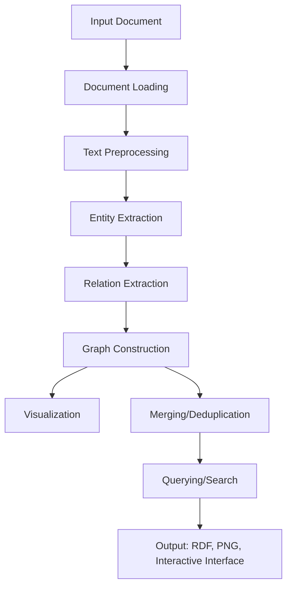

# Knowledge Graph System

An AI-assisted pipeline that extracts entities and relationships from unstructured documents (PDF, TXT, DOCX) and builds RDF knowledge graphs you can visualize, search semantically, question in natural language, and query with SPARQL.

Written in Kotlin as a Gradle multimodule project:

- `backend/` — Kotlin/JVM: Ktor HTTP API, Apache Jena (RDF + SPARQL), Stanford CoreNLP (NER, dependency patterns), DJL `all-MiniLM-L6-v2` embeddings, Koog for OpenAI access, plus CLI and batch entry points
- `frontend/` — Kotlin/JS React UI (JetBrains kotlin-wrappers): landing page and graph workspace
- `application/` — the full-stack assembly: the backend plus the production UI bundle, served by one Ktor server
- `docs/FUNCTIONAL_REQUIREMENTS.md` — the behaviour both modules implement

## Visual interface


The workspace after uploading a file:


## Features

- **Document processing**: PDF (PDFBox), DOCX (POI) and plain text
- **Entity extraction**: CoreNLP NER, optionally refined by an LLM with typed structured output
- **Relation extraction**: dependency-parse patterns plus LLM inference, merged and validated
- **Graph construction**: RDF graphs with deduplication and merging across documents
- **Visualization**: PNG network diagrams (JGraphT + JGraphX)
- **Querying**: semantic search, LLM question answering, entity relations, SPARQL SELECT
- **Batch processing**: several documents into one unified graph

## Pipeline



## Prerequisites

- JDK 21+ (the Gradle wrapper downloads Gradle; Kotlin/JS downloads its own Node.js)
- An OpenAI API key for the LLM steps, in `backend/.env` (`OPENAI_API_KEY=...`) or the environment. Without it the LLM steps are skipped and question answering is unavailable.

First run downloads the CoreNLP models (about 500 MB) and the MiniLM weights.

## Running

Full stack, one server — the API and the production UI on http://localhost:8000:

```bash
./gradlew :application:runFullStack                      # run it from Gradle
./gradlew :application:installDist                       # or build application/build/install/application/bin/application
./gradlew :application:buildFatJar                       # or a single application/build/libs/application-all.jar
```

Development, with hot reload on the UI:

```bash
./gradlew :backend:run                                   # API only on http://localhost:8000
./gradlew :frontend:jsBrowserDevelopmentRun --continuous # UI on http://localhost:8080, API calls proxied to :8000
```

Other tasks:

```bash
./gradlew :backend:runCli -Pfile=doc.pdf                 # single document + interactive query menu
./gradlew :backend:runBatch -Pargs="./documents/"        # batch into one graph
./gradlew build                                          # compile, test, lint everything
```

The port defaults to 8000; set `PORT` to change it. Output (Turtle files, PNG visualizations) goes to `output/` under the working directory (`backend/` when run from Gradle), logs to `logs/`.

## API

| Method | Path | Purpose |
|---|---|---|
| GET | `/api` | Service description (also at `/` when the UI is not bundled) |
| POST | `/upload` | Upload a document and build its graph |
| GET | `/health` | Health check |
| GET | `/graphs` | List graphs |
| GET | `/graph/{id}` | Graph details |
| DELETE | `/graph/{id}` | Delete a graph |
| GET | `/visualization/{id}` | Download the PNG visualization |
| GET | `/download_graph/{id}` | Download the RDF (Turtle) file |
| GET | `/entities/{id}` | Entities of a graph |
| GET/POST/DELETE | `/chat_history/{id}` | Chat history of a graph |
| POST | `/semantic_search` | Semantic search |
| POST | `/question_answer` | LLM question answering |
| POST | `/entity_relations` | Relations of an entity |
| POST | `/sparql_query` | Run a SPARQL SELECT |

See `backend/README.md` and `frontend/README.md` for module details and design decisions.

## License

See `LICENSE`.
