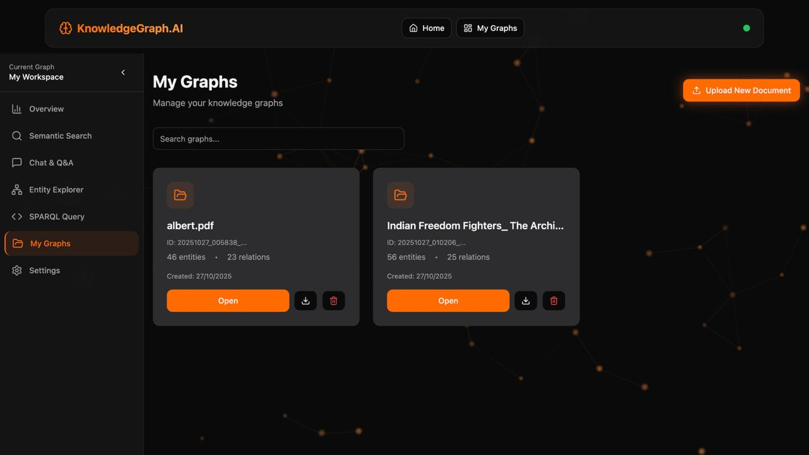
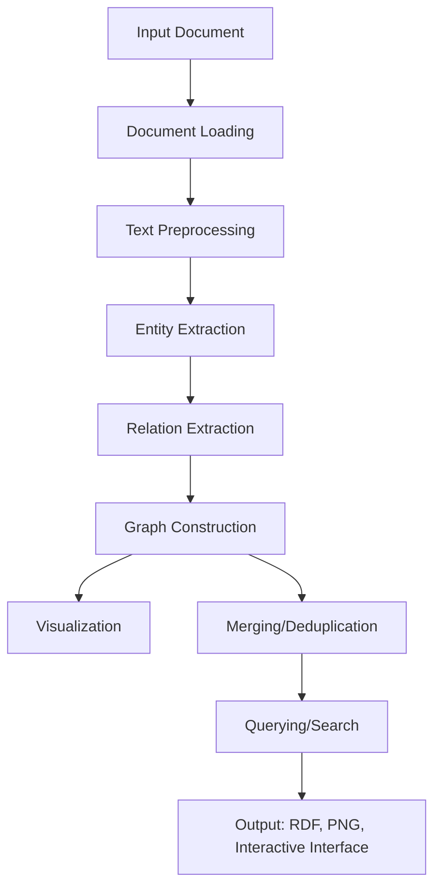

# Knowledge Graph System

An AI-assisted pipeline that extracts entities and relationships from unstructured documents (PDF, TXT, DOCX) and builds RDF knowledge graphs you can visualize, search semantically, question in natural language, and query with SPARQL.

Written in Kotlin as a Gradle multimodule project:

- `backend/` — Kotlin/JVM: Ktor HTTP API, Apache Jena (RDF + SPARQL), Stanford CoreNLP (NER, dependency patterns), DJL `all-MiniLM-L6-v2` embeddings, Koog for OpenAI access, plus CLI and batch entry points
- `frontend/web/` — Kotlin/JS React UI (JetBrains kotlin-wrappers): landing page and graph workspace
- `frontend/cloud/` — Kotlin/JS library: the 3D graph cloud view (three.js via react-three-fiber) embedded by `web`
- `application/` — the full-stack assembly: the backend plus the production UI bundle, served by one Ktor server
- `docs/FUNCTIONAL_REQUIREMENTS.md` — the functional specification: the original system's behaviour (§§1–10) and what this implementation changed and added (§11)

## Visual interface


The workspace after uploading a file:



## Features

- **Document processing**: PDF (PDFBox), DOCX (POI) and plain text
- **Entity extraction**: CoreNLP NER, optionally refined by an LLM with typed structured output
- **Relation extraction**: dependency-parse patterns plus LLM inference, merged and validated
- **Graph construction**: RDF graphs with deduplication and merging across documents
- **Visualization**: PNG network diagrams (JGraphT + JGraphX) and an interactive 3D cloud of the graph in the workspace (drag to rotate, click to focus, Escape and ←/→ to navigate)
- **Querying**: semantic search, LLM question answering, entity relations, SPARQL SELECT
- **Graph Assistant**: a site-wide chat that floats over every page, modelled on Salesforce's Agentforce panel: a button, a card, a docked sidebar or fullscreen; answers about the graph the page is on, cites the facts it used, keeps history per graph
- **Batch processing**: several documents into one unified graph

## Pipeline



## Prerequisites

- JDK 21+ (the Gradle wrapper downloads Gradle; Kotlin/JS downloads its own Node.js)
- An OpenAI-compatible chat endpoint for the LLM steps, configured with the standard OpenAI variables in `backend/.env` or the environment: `OPENAI_API_KEY` (required), `OPENAI_BASE_URL` (default `https://api.openai.com/v1`), `OPENAI_MODEL` (default `gpt-4o-mini`). A local gateway such as `OPENAI_BASE_URL=http://127.0.0.1:8000/v1` with `OPENAI_MODEL=sonnet` works the same way. Without a key the LLM steps are skipped and question answering is unavailable.

First run downloads the CoreNLP models (about 500 MB) and the MiniLM weights.

## Running

Full stack, one server — the API and the production UI on http://localhost:8000:

```bash
./gradlew :application:runFullStack                      # run it from Gradle
./gradlew :application:installDist                       # or build application/build/install/application/bin/application
./gradlew :application:buildFatJar                       # or a single application/build/libs/application-all.jar
```

Development, with hot reload on the UI:

```bash
./gradlew :backend:run                                   # API only on http://localhost:8000
./gradlew :frontend:web:jsBrowserDevelopmentRun --continuous # UI on http://localhost:8080, API calls proxied to :8000
```

Other tasks:

```bash
./gradlew :backend:runCli -Pfile=doc.pdf                 # single document + interactive query menu
./gradlew :backend:runBatch -Pargs="./documents/"        # batch into one graph
./gradlew build                                          # compile, test, lint everything
```

The port defaults to 8000; set `PORT` to change it. Logs go to `logs/` under the working directory (`backend/` when run from Gradle).

## Storage

Graphs are kept in an [Apache Jena TDB2](https://jena.apache.org/documentation/tdb2/) triple store, not in files, so they survive restarts and can be queried as one dataset. The data directory is `data/` under the working directory; set `KG_DATA_DIR` (environment or `.env`) to move it outside the checkout.

| Path | Content |
|---|---|
| `$KG_DATA_DIR/tdb2/` | The TDB2 dataset. One named graph `http://example.org/kg/graph/<id>` per document; graph descriptions (source file, creation time, counts, VoID statistics) in `http://example.org/kg/graphs`; chat history in `http://example.org/kg/chat/<id>` |
| `$KG_DATA_DIR/graphs/<id>/` | The uploaded document, the rendered `knowledge_graph.png`, and `knowledge_graph.ttl` when exported by the CLI or batch tools |

`GET /download_graph/{id}` serializes the named graph on demand. The CLI (`runCli`) and batch (`runBatch`) tools store their graphs in the same dataset, so the API and UI can serve them. TDB2 is single-process: stop the server before opening the directory with another tool such as Fuseki (`fuseki-server --loc data/tdb2 /kg`).

## API

| Method | Path | Purpose |
|---|---|---|
| GET | `/api` | Service description (also at `/` when the UI is not bundled) |
| POST | `/upload` | Upload a document and build its graph |
| GET | `/health` | Health check |
| GET | `/graphs` | List graphs |
| GET | `/graph/{id}` | Graph details |
| DELETE | `/graph/{id}` | Delete a graph |
| GET | `/visualization/{id}` | Download the PNG visualization |
| GET | `/download_graph/{id}` | Download the RDF (Turtle) file |
| GET | `/graph/{id}/cloud.json` | The graph as nodes and links for the 3D cloud view |
| GET | `/entities/{id}` | Entities of a graph |
| GET/POST/DELETE | `/chat_history/{id}` | Chat history of a graph |
| POST | `/semantic_search` | Semantic search |
| POST | `/question_answer` | LLM question answering |
| POST | `/entity_relations` | Relations of an entity |
| POST | `/sparql_query` | Run a SPARQL SELECT |

See `backend/README.md` and `frontend/web/README.md` for module details and design decisions.

## License

See `LICENSE`.
