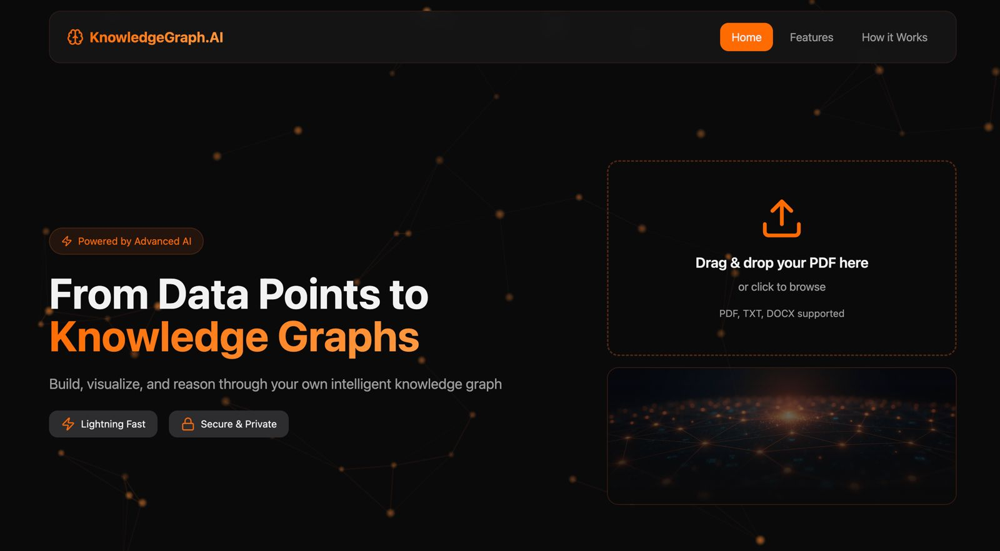
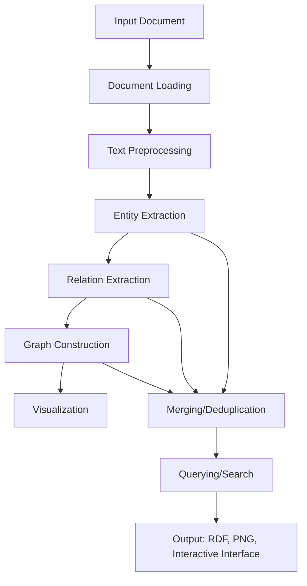

# Knowledge Graph System README

## 🧠 Introduction

The Knowledge Graph System is a comprehensive AI-powered pipeline for extracting entities and relationships from unstructured documents (PDF, TXT, DOCX) to build structured knowledge graphs. It leverages natural language processing (NLP) techniques, including SpaCy for rule-based extraction and OpenAI's large language models (LLMs) for advanced entity and relation extraction. The system supports visualization, querying, and semantic search over the constructed graphs.

This project provides both a command-line interface for batch processing and a web-based Streamlit application for interactive exploration. It uses RDF (Resource Description Framework) for graph representation, enabling standard semantic web querying via SPARQL.

## Visual Interface



And the workspace after uploading the file is 


### Key Features
- **Document Processing**: Supports multiple file formats with robust text extraction.
- **Entity Extraction**: Combines SpaCy and LLM-based approaches for high-accuracy named entity recognition (NER).
- **Relation Extraction**: Uses dependency parsing patterns and LLM inference to identify relationships between entities.
- **Graph Construction**: Builds RDF graphs with deduplication and merging capabilities.
- **Visualization**: Generates network diagrams using NetworkX and Matplotlib.
- **Querying and Search**: Interactive interfaces for semantic search, question answering, entity relations, and SPARQL queries.
- **Batch Processing**: Handles multiple documents to create unified knowledge graphs.
- **Web Interface**: Streamlit-based UI for easy document upload, graph browsing, and querying.

### Technologies Used
- **Backend**: FastAPI for RESTful API, RDFlib for RDF graph management.
- **NLP**: SpaCy for preprocessing, Sentence Transformers for semantic embeddings.
- **LLM Integration**: OpenAI API (GPT-3.5-Turbo and GPT-4o-mini) for enhanced extraction.
- **Frontend**: Streamlit for interactive web application.
- **Visualization**: NetworkX and Matplotlib for graph rendering.
- **Deployment**: Uvicorn for API server, shell scripting for startup.

## 📁 Directory Structure

The project follows a modular structure for clarity and maintainability:

```
/Volumes/Crucial X6/Knowledge-Graphs/
├── .env                     # Environment variables (API keys, configurations)
├── .git/                    # Git repository metadata
├── .gitignore               # Files to ignore in version control (e.g., .env, __pycache__)
├── .qodo/                   # Code quality tool configuration (if applicable)
├── __pycache__/             # Python bytecode cache (auto-generated)
├── api.py                   # FastAPI backend server for REST endpoints
├── app.py                   # Streamlit web application frontend
├── batch_processor.py       # Script for processing multiple documents into a unified graph
├── config.py                # Configuration constants and settings
├── document_processor.py    # Module for loading and extracting text from documents
├── entity_extractor.py      # Named entity recognition using SpaCy and LLM
├── env/                     # Potential virtual environment directory (if used)
├── graph_builder.py         # RDF knowledge graph construction and management
├── graph_querier.py         # SPARQL and entity relation querying
├── graph_visualizer.py      # Graph visualization using NetworkX
├── logs/                    # Directory for application logs (auto-generated)
├── main.py                  # Main pipeline script for end-to-end processing
├── openai_helper.py         # Helper for OpenAI API interactions
├── output/                  # Directory for generated graphs, visualizations, and RDF files
├── past_scripts/            # Deprecated or archived scripts
├── relation_extractor.py    # Relation extraction using patterns and LLM
├── requirements.txt         # Python dependencies
├── semantic_retriever.py    # Semantic search and question answering over the graph
├── start.sh                 # Shell script to launch backend and frontend services
├── text_preprocessor.py     # Text cleaning and preprocessing utilities
```

### Key Files Description
- **Core Modules**:
  - `main.py`: Orchestrates the full pipeline from document input to graph querying.
  - `batch_processor.py`: Processes multiple files into a single unified graph.
  - `api.py`: FastAPI endpoints for web interactions.
  - `app.py`: Streamlit UI for user interaction.
- **Processing Modules**:
  - `document_processor.py`: Handles file loading and text extraction.
  - `text_preprocessor.py`: Cleans and normalizes text.
  - `entity_extractor.py`: Extracts entities using SpaCy and LLM.
  - `relation_extractor.py`: Finds relationships between entities.
  - `graph_builder.py`: Constructs and saves RDF graphs.
  - `graph_visualizer.py`: Generates visual representations.
  - `graph_querier.py`: Enables SPARQL and relation queries.
  - `semantic_retriever.py`: Provides semantic search and LLM-based QA.
- **Utilities**:
  - `config.py`: Holds configuration constants.
  - `openai_helper.py`: Manages OpenAI API calls.
  - `requirements.txt`: Lists dependencies.
  - `start.sh`: Startup script for services.
- **Output and Logs**:
  - `output/`: Stores generated RDF files (.ttl), visualizations (.png), etc.
  - `logs/`: Contains runtime logs from API and Streamlit.

## ☕ Kotlin multimodule port

A Gradle multimodule project alongside the Python code:

- `backend/` — Kotlin/JVM: Ktor API, Apache Jena RDF, Stanford CoreNLP, DJL embeddings, Koog LLM access, plus the CLI and batch entry points
- `frontend/` — Kotlin/JS React (JetBrains kotlin-wrappers): the same pages, tabs and design tokens
- `docs/FUNCTIONAL_REQUIREMENTS.md` — the behaviour both modules implement, traced to the original files

```bash
./gradlew :backend:run                                  # API on :8000
./gradlew :frontend:jsBrowserDevelopmentRun --continuous # UI on :8080
./gradlew build                                         # compile, test, lint everything
```

See `backend/README.md` and `frontend/README.md` for the module maps and the decisions taken.

## 🔄 Pipeline and Workflow

The system follows a structured pipeline for building knowledge graphs:

1. **Document Loading**: Extracts text from input files (PDF, TXT, DOCX) using libraries like PyPDF2 and python-docx.
2. **Text Preprocessing**: Cleans text by removing noise, tokenizing, and normalizing.
3. **Entity Extraction**: 
   - Uses SpaCy for rule-based NER (e.g., PERSON, ORG).
   - Optionally enhances with OpenAI LLM for better accuracy.
   - Merges and deduplicates entities.
4. **Relation Extraction**: 
   - Applies SpaCy dependency parsing for pattern-based relations.
   - Uses OpenAI LLM for context-aware relationship inference.
   - Merges and validates relations.
5. **Graph Construction**: Builds an RDF graph using RDFlib, adding entities and relations as triples.
6. **Visualization**: Converts the graph to a NetworkX diagram and saves as PNG.
7. **Querying and Search**: Supports semantic search, QA, entity relations, and SPARQL queries.
8. **Batch Processing**: For multiple files, deduplicates entities/relations across documents.

The pipeline is automated in `main.py` for single files or `batch_processor.py` for batches.

### Flow Diagram



- **Arrows indicate data flow**.
- **Parallel paths**: Entity and relation extraction can run concurrently.
- **Feedback Loop**: Outputs can be queried interactively via CLI or web UI.

For a textual representation:

```
[Input Document] --> [Document Loading] --> [Text Preprocessing]
                         |
                         v
[Entity Extraction] --> [Relation Extraction] --> [Graph Construction]
                         |                           |
                         v                           v
[Visualization] <-- [Merging/Deduplication] <-- [Querying/Search]
                         |
                         v
[Output: RDF, PNG, Interactive Interface]
```

## 🚀 Installation and Setup

### Prerequisites
- Python 3.8+ (tested on 3.10+).
- OpenAI API key (for LLM features; set in `.env`).
- Git for cloning.

### Cloning the Repository
1. Clone the repository:
   ```bash
   git clone https://github.com/MadsDoodle/Knowledge-Graphs.git
   cd Knowledge-Graphs
   ```

2. Set up a virtual environment (recommended):
   ```bash
   python3 -m venv env
   source env/bin/activate  # On Windows: env\Scripts\activate
   ```

3. Install dependencies:
   ```bash
   pip install -r requirements.txt
   ```

4. Set up environment variables:
   - Create a `.env` file in the root directory.
   - Add your OpenAI API key: `OPENAI_API_KEY=your_api_key_here`.
   - Other configurations are in `config.py` (e.g., models, timeouts).

5. Install NLP models:
   ```bash
   python3 -m spacy download en_core_web_sm
   ```

### Configuration
- Edit `config.py` for defaults (e.g., namespace, figure sizes).
- Ensure `.env` is secure (added to `.gitignore`).

## 🏃 Running the System

### Option 1: Web Interface (Streamlit + FastAPI)
Use the provided `start.sh` script to launch both services:
1. Ensure dependencies are installed and `.env` is configured.
2. Run the startup script:
   ```bash
   bash start.sh
   ```
   - This starts:
     - FastAPI backend on `http://localhost:8000` (with docs at `/docs`).
     - Streamlit frontend on `http://localhost:8501`.
   - Logs are saved in `logs/` and can be monitored.
   - Press `Ctrl+C` to stop services.

3. Access the web UI:
   - Upload documents, view graphs, and query interactively.

### Option 2: Command-Line Pipeline
For single or batch processing:
1. Run the main pipeline:
   ```bash
   python3 main.py [input_file.pdf]  # For a single file; uses sample if none.
   ```
   - Processes the file, builds the graph, visualizes, and launches an interactive query CLI.

2. For batch processing:
   ```bash
   python3 batch_processor.py documents/  # Processes all PDFs in a directory.
   python3 batch_processor.py file1.pdf file2.pdf  # Specific files.
   ```
   - Outputs unified graph in `output/`.

### Option 3: Direct Module Usage
Import and use modules in custom scripts (see code examples in files).

## 📖 Usage Examples

### Command-Line Examples
- Process a single PDF and query:
  ```bash
  python3 main.py sample.pdf
  ```
  - Follow CLI prompts for semantic search, QA, etc.

- Batch process directory:
  ```bash
  python3 batch_processor.py ./docs/
  ```

### Web UI Examples
1. **Upload Document**: Select file, click "Create Knowledge Graph".
2. **Browse Graphs**: View metadata, download RDF, select for querying.
3. **Query Graph**:
   - **Semantic Search**: Enter query like "artificial intelligence".
   - **Question Answering**: Ask "What is AI?" (requires OpenAI key).
   - **Entity Relations**: Select entity and find connections.
   - **SPARQL Query**: Execute custom queries (examples provided).

### API Endpoints (via FastAPI)
- `POST /upload`: Upload file and build graph.
- `GET /graphs`: List all graphs.
- `GET /graph/{id}`: Get graph details.
- `GET /visualization/{id}`: Download visualization.
- `POST /semantic_search`: Perform search.
- `POST /question_answer`: LLM-based QA.
- `POST /entity_relations`: Find relations.
- `POST /sparql_query`: Execute SPARQL.
- Visit `http://localhost:8000/docs` for interactive API docs.

## 🔧 Configuration Details
- **OpenAI Integration**: Required for LLM features; set `OPENAI_API_KEY`.
- **Models**: SpaCy (`en_core_web_sm`), Sentence Transformers (`all-MiniLM-L6-v2`).
- **Visualization**: Customizable in `config.py` (e.g., node sizes, colors).
- **Timeouts/Retries**: Configured for API calls.

## 🐛 Troubleshooting
- **API Key Issues**: Ensure `.env` is loaded and key is valid.
- **Model Downloads**: Run `python3 -m spacy download en_core_web_sm`.
- **Port Conflicts**: Change ports in `start.sh` or `config.py`.
- **Logs**: Check `logs/fastapi.log` and `logs/streamlit.log`.
- **Memory**: For large documents, increase chunk sizes in `relation_extractor.py`.

## 🤝 Contributing
- Fork the repository and submit pull requests.
- Report issues via GitHub.
- Follow code style: PEP 8 for Python.

## 📄 License
This project is open-source. See LICENSE for details (if applicable).

## 📞 Support
For questions, check the code comments or create an issue.

---

*This README provides a complete guide to the Knowledge Graph System. Ensure all dependencies are installed before running.*